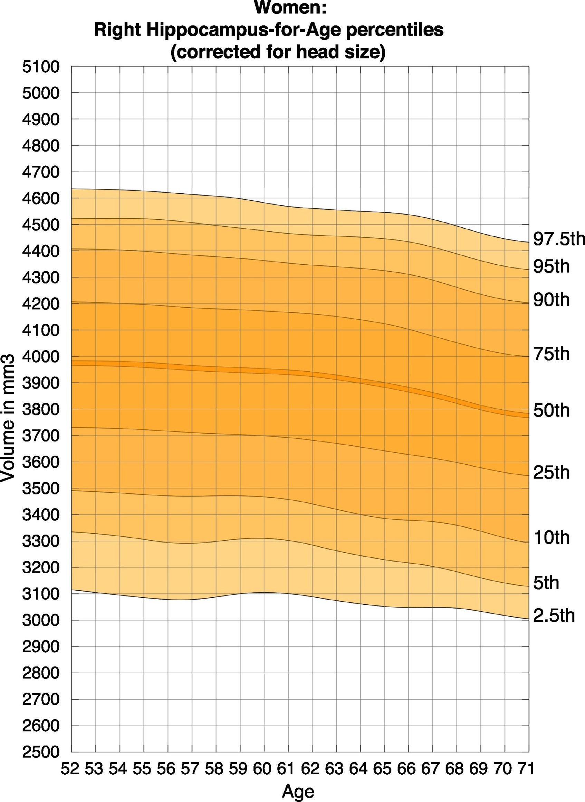

# Hippocampus AI 

This project is part of the Udacity AI for Healthcare nanodegree program.

The **Project Overview** below are taken from the starter description of the project delivered by Udacity. The file  describes the results and validation plan required to run this project in a clinical context.

## Project Overview

### Background

Alzheimer's disease (AD) is a progressive neurodegenerative disorder that results in impaired neuronal (brain cell) function and eventually, cell death. AD is the most common cause of dementia. Clinically, it is characterized by memory loss, inability to learn new material, loss of language function, and other manifestations. 

For patients exhibiting early symptoms, quantifying disease progression over time can help direct therapy and disease management. 

A radiological study via MRI exam is currently one of the most advanced methods to quantify the disease. In particular, the measurement of hippocampal volume has proven useful to diagnose and track progression in several brain disorders, most notably in AD. Studies have shown reduced volume of the hippocampus in patients with AD.

The hippocampus is a critical structure of the human brain (and the brain of other vertebrates) that plays important roles in the consolidation of information from short-term memory to long-term memory. In other words, the hippocampus is thought to be responsible for memory and learning (that's why we are all here, after all!)

Humans have two hippocampi, one in each hemishpere of the brain. They are located in the medial temporal lobe of the brain. Fun fact - the word "hippocampus" is roughly translated from Greek as "horselike" because of the similarity to a seahorse, a peculiarity observed by one of the first anatomists to illustrate the structure.

According to [studies](https://www.sciencedirect.com/science/article/pii/S2213158219302542), the volume of the hippocampus varies in a population, depending on various parameters, within certain boundaries, and it is possible to identify a "normal" range when taking into account age, sex and brain hemisphere. 

There is one problem with measuring the volume of the hippocampus using MRI scans, though - namely, the process tends to be quite tedious since every slice of the 3D volume needs to be analyzed, and the shape of the structure needs to be traced. The fact that the hippocampus has a non-uniform shape only makes it more challenging. Do you think you could spot the hippocampi in this axial slice?

As you might have guessed by now, we are going to build a piece of AI software that could help clinicians perform this task faster and more consistently.

You have seen throughout the course that a large part of AI development effort is taken up by curating the dataset and proving clinical efficacy. In this project, we will focus on the technical aspects of building a segmentation model and integrating it into the clinician's workflow, leaving the dataset curation and model validation questions largely outside the scope of this project.

### What You Will Build

In this project you will build an end-to-end AI system which features a machine learning algorithm that integrates into a clinical-grade viewer and automatically measures hippocampal volumes of new patients, as their studies are committed to the clinical imaging archive.

Fortunately you won't have to deal with full heads of patients. Our (fictional) radiology department runs a HippoCrop tool which cuts out a rectangular portion of a brain scan from every image series, making your job a bit easier, and our committed radiologists have collected and annotated a dataset of relevant volumes, and even converted them to NIFTI format!

You will use the dataset that contains the segmentations of the right hippocampus and you will use the U-Net architecture to build the segmentation model.

After that, you will proceed to integrate the model into a working clinical PACS such that it runs on every incoming study and produces a report with volume measurements.

### The Dataset

We are using the "Hippocampus" dataset from the [Medical Decathlon competition](http://medicaldecathlon.com/). This dataset is stored as a collection of NIFTI files, with one file per volume, and one file per corresponding segmentation mask. The original images here are T2 MRI scans of the full brain. As noted, in this dataset we are using cropped volumes where only the region around the hippocampus has been cut out. This makes the size of our dataset quite a bit smaller, our machine learning problem a bit simpler and allows us to have reasonable training times. You should not think of it as "toy" problem, though. Algorithms that crop rectangular regions of interest are quite common in medical imaging. Segmentation is still hard.

## Results

### Exploratory Data Analysis

Exploratory Data Analysis involves:
* viewing exemplary images in notebook and 3D Slicer,
* investigating NIFTI files,
* calculating hippocampus volumes and plotting the distribution,
* finding outliers.

Screenshot from 3D Slicer:

### Model Training

UNet architecture is used to build the segmentation model. Metrics like Dice score, Jaccard score, Sensitivity and Specificity are implemented to evaluate the model performance.

Visualisations from Tensorboard:

### Clinical Network Integration

Clinical network in this project consists of:
* 'send_volumes.py' script which simulates sending volumes from MRI scanner to the PACS,
* Orthanc - PACS server representation,
* OHIF - viewer system,
* AI module - HippoVolume.AI which predicts the hippocampus mask on the incoming image and calculates its volume.

Screenshot from OHIF showing the final report with predicted mask and calculated volumes:

## License

This project is licensed under the MIT License.
